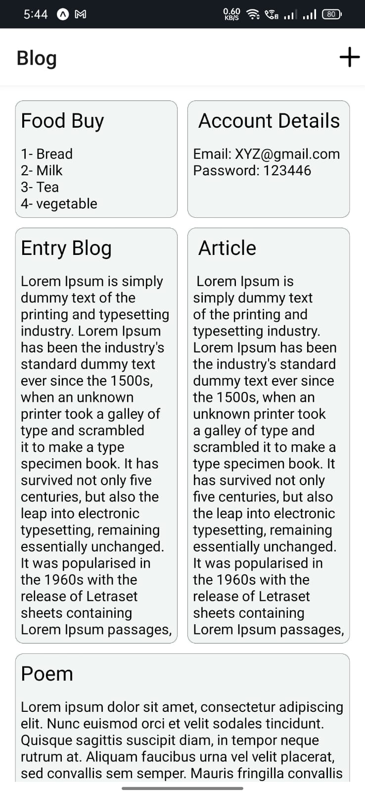
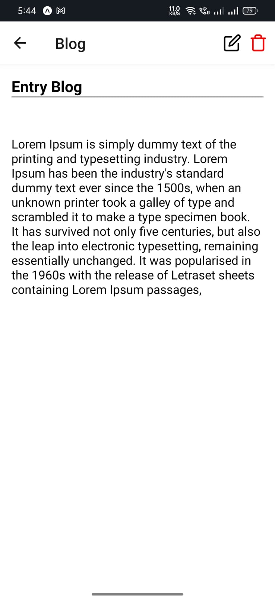
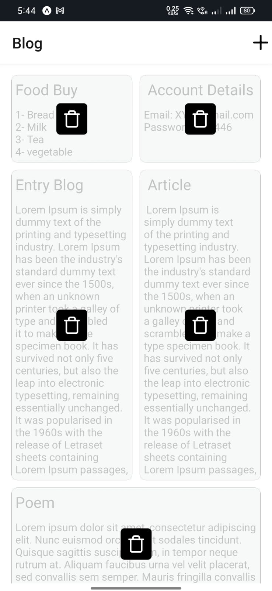
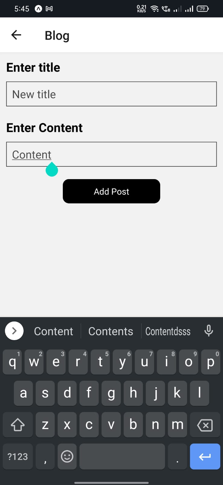
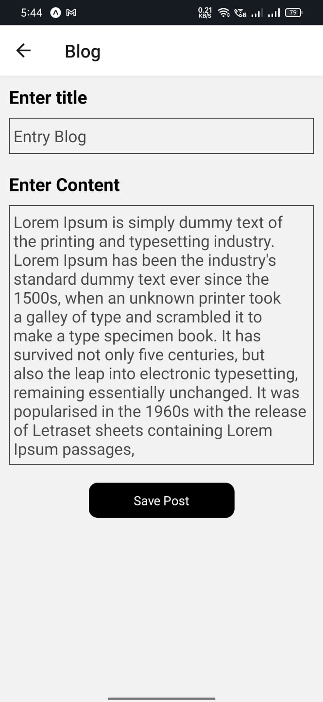

# NoteKepper
Json Server Code is in "jason-server" branch

<a name="readme-top"></a>

<details>
  <summary>Table of Contents</summary>
  <ol>
    <li>
      <a href="#about-the-project">About The Project</a>
      <ul>
        <li><a href="#built-with">Built With</a></li>
      </ul>
    </li>
    <li>
      <a href="#getting-started">Getting Started</a>
      <ul>
        <li><a href="#prerequisites">Prerequisites</a></li>
        <li><a href="#installation">Installation</a></li>
      </ul>
    </li>
    <li><a href="#screenshots">ScreenShots</a></li>
    <li><a href="#contact">Contact</a></li>
  </ol>
</details>


## About The Project

"NoteKeeper" is a productivity app that lets you manage notes on the go. You can save, update, delete, and create notes with ease. Your data is securely stored on a JSON server, ensuring that your information is always accessible. This app is built using React Native and JSON server technology, providing a fast and efficient experience for users. Get organized and stay on top of your tasks with NoteKeeper!

<p align="center">
  
</p>

<p align="right">(<a href="#readme-top">back to top</a>)</p>

## Built with
<p align="center">
  
</p>

<ul>
  <li>I built this app using react native expo cli</li>
  <li>Used Jason Server for storing data and keep safely.</li>
  <li>Used react native hooks such as useState ,useEffect and useContext.</li>
  <li>For react navigation I used react navigation Version 4</li>
</ul>  

<p align="right">(<a href="#readme-top">back to top</a>)</p>

## Getting Started

## Prerequisites

* npm
```sh
  npm install -g npm
```
* React navigation V4
  1. Install react navigation
  ```sh
    npm install react-navigation
  ```
  2. Install Dependencies
  ```sh
    npm install react-navigation
  ```
  3. Install React Navigation Stack
  ```sh
    npm install react-navigation-stack
  ```
<p align="right">(<a href="#readme-top">back to top</a>)</p>

## Installation
1. Clone the Jason Server repo.
```sh
 https://github.com/prajesh9921/Notes-App---React-Native.git
```
2. Clone a repo
```sh
  https://github.com/prajesh9921/Notes-App---React-Native.git
```
3. Make sure `npm` is installed
4. Open terminal in your project directory.
5. Start your project using 
```sh
  npm start
````
5. Now its time to start running jason server.
6. Open terminal in Jason Server directory and run below command.
```sh
  npm run db
```
  This command will start you json server listeing to port defined.
8. Now open another terminal in same directory and run below command.
```sh
  npm run tunnel
```
  This command will start the ngrok for connection outside system.
7. Install expo app in your phone.
8. Scan the QR code from your app and app should be up and runnig.

<p align="right">(<a href="#readme-top">back to top</a>)</p>

## ScreenShots

     

<p align="right">(<a href="#readme-top">back to top</a>)</p>

## Contact

<p align="center">Email: prajeshwork30@gmail.com</p>
<p align="center"><a href="https://www.linkedin.com/in/prajesh-gawhale-b0b9b3190/">Linkedin Link</a></p>
<p align="center"><a href="https://drive.google.com/file/d/1kymEkjjv3vk78CnyMv-xny3r408bZpvt/view?usp=share_link">Resume Link</a></p>  
<p align="center">Open for any Job / Internship opportunity</p>


